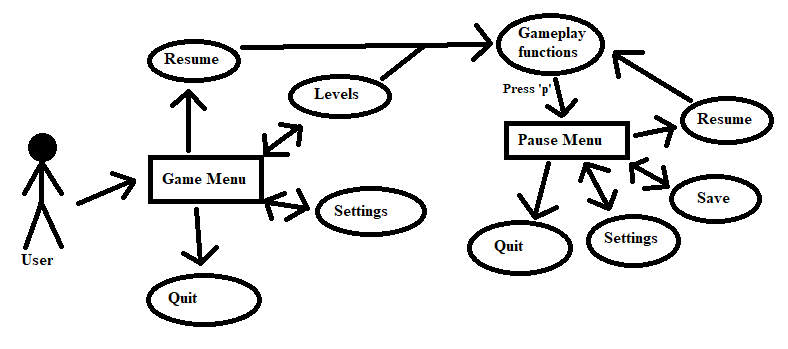
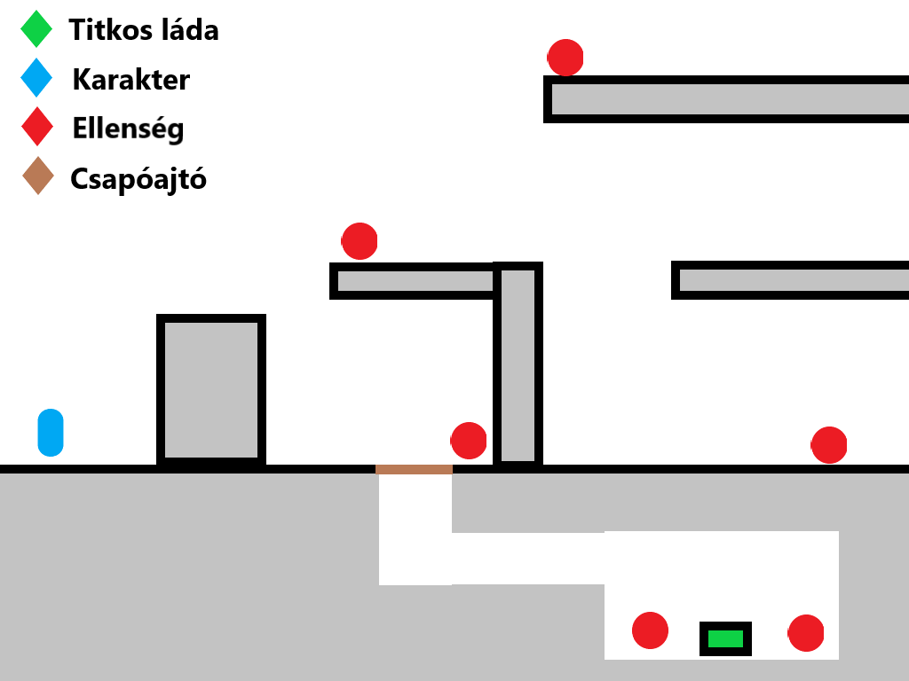

# Funkcionális specifikáció

##  Áttekintés
Egy olyan asztali alkalmazást fejlesztünk, amelyben a felhasználó végigjátszhat egy történetet, miközben új felszereléseket és fegyvereket szerezhet, mindezt
egy platformer stílusú, oldalnézetes játékban. A játék több különböző pályából fog állni. A felhasználó útja a program használata során rögzített, mivel a játék főhősének egy célja van, hogy kiderítse
mi történt a környezetében, ehhez pedig feltétlen szükséges az összes pályán való végighaladás. A felhasználónak lehetősége lesz új fegyvereket és felszereléseket
szereznie játék közben. Ennek az egyik módja az, hogy halad tovább a történetben és bizonyos pályák után automatikusan feloldódik és használhatóvá válik
számára az adott felszerelés. A másik módhoz egy kis szerencse kell, ugyanis egyes pályákon elrejtünk pár különleges fegyvert vagy felszerelést, amelyek
megszerzéséhez a felhasználónak egy rejtett dolgot kell megtalálnia vagy problémát megoldania.
Minden pálya elvégzése után a felhasználónak lehetősége nyílik megváltoztatni a felszerelését, például ha kioldott egy új fegyvert és a továbbiakban
a régi helyett azt szeretné használni.
A karaktertünk halála esetén nem az egész játékot, csupán a megkezdett pályát kell előlről kezdeni.
A játék akkor ér véget ha a felhasználó sikeresen teljesítette az összes pályát.

## Jelenlegi helyzet
A megrendelő kérése egy régi klasszikusokat idéző, 2D alapú platformer. Melyet egyedi ötletével szeretné megvalósítani. Eddigi játékok során nem találkozott még olyannal, melyben egy felrobbant atomerőművet kell elhagyni és ezzel a különös ötlettel keresett meg minket. Mely szerinte betölti ezt a "piaci rést". Ezzel az újító ötlettel szeretne piaci és anyagi előnyökhöz jutni. A játékot a legnagyobb játékosközösség miatt, és így legtöbb profit miatt PC re kell fejleszteni.

## Követelménylista
### Pálya rendszer:
- Megtekinhetőek a pályák nevei
- Azokhoz tartozó képek
- Az, hogy teljesitett-e az adott pálya
- A teljesitmény szintje
- A rejtett tárgy meg lett-e találva

### Felszerelés rendszer
- Fontosabb felszerelésben szereplő tárgyak mindig láthatóak
- Összes tárgy megtekintése gombnyomásra
- Tárgyak használata
- Tárgyak kidobása

### Fegyver rendszer
- Távolharci fegyverek
- Közelharci fegyverek
- Rejtett fegyverek
- Fegyverek lövése
- Fegyverek újratöltése
- Ammunició követése

### Harcrendszer
- Közelharci és lőfegyverekkel zajlik
- Az alapvető fegyverek: kés és pisztoly
- Speciális képességek különleges fegyvereket adnak
- Ha 0-ra esik a HP-ja egy karakternek, meghal

### Mozgás rendszer
- Jobbra való mozgás
- Balra való mozgás
- Ugrás
- Falon ugrás
- Kúszás
- Egér irányába való lövés

### Képességrendszer
- Képességpontokat lehet gyűjteni
- Ágakon lehet képességeket fejleszteni
- Szintek alapján lehet fejleszteni
- Bónuszokat adnak, ágakon lehet továbbvinni őket

### Lootrendszer
- Az ellenségek dobhatnak tárgyakat
- A pályán vannak lootolható ládák
- Növényeket is lehet gyűjteni
- A pályán szétszórva itemek találhatók

### Raktár
- Itemek tárolása
- Bővíthető (nagyobb táskával)
- Bázison is lehet tárolni itemeket
- Lapozható raktárabalakok

### Ellenségek
- Különféle típusúak
- A játékos érzékelésekor támadnak
- Lehet tőlük zsákmányolni
- Küldetésekben lehet szerepük

### Barátságos NPC-k
- Történetet viszik előrébb
- Küldetéseket adnak
- Lehet tőlük tárgyakat vásárolni
- El lehet nekik adni tárgyakat

### Felhasználói felület:
- Belépéskor választható menüpontok: Resume, Levels, Settings, Quit
- Játék közben történő megállításkor a Levels helyett Save opció jelenik meg
- A sarkokban mutatja a játékos életerejét, fegyverét és töltényeinek számát, leltárát és egyéb gombokat, mint pl.: Skills
- Leltárban a fegyverekre húzva az egeret megjelennek annak statjai és a lehetséges tevékenységek

## Jelenlegi üzleti folyamatok modellje

### Az alábbi üzleti folyamatmodellt kell átalakítani az Igényelt üzleti folyamatok modellje c. fejezet alapján:
- A megrendelő olyan céget üzemeltet, ahol hosszú és kihívást jelentő játékokat készítenek.
- A játékok egy része platformer stílusú.
- Az ügyfél nem elégedett a jelenlegi eladások számával.
- Az eladások kevés száma azért van, mivel már egy ideje nem hoztak piacra új játékot.

## Igényelt üzleti folyamatok
A játékokkal kapcsolatos elvárások és igények kielégítésére az ügyfél ötlete tökéletesen alkalmas.
Az emberek manapság sokkal inkább érdeklődnek a retro jellegű platformerek iránt, épp ezért a cél egy ilyen jellegű játék létrehozása. Mely alkalmazkodik az eddigi üzleti folyamatokhoz: 
van benne kihívás és hosszan tartó szórakoztató játékélmény.

### Célok
- Átlátható felhasználói felület készítése a játékhoz
- Élvezetes játékmenet megvalósítása
- A platformer játékok színesítése
- Nagyob, közösségre alapuló projektek lehetőségeinek megteremtése
- Többféle eszközről is játszható játék, ami növeli a népszerűséget
- Új játékosbázis kialakítása
### Előnyök
- Új játékosbázis
- Régi játékosok visszacsábítása a platformra
- Új promóciós lehetőségek
- Nagy profit
- A játék jellegéből adódóan: népszerűség

## Használati esetek

### Ábra

### Leírás
- A játék megnyitását követően a főmenüt látja a felhasználó
- Innen folytathatja a félbehagyott játék mentett állását, vagy...
- ... kiléphet a játékból, vagy...
- ... pályát választhat (innen vissza is tud lépni a főmenübe), vagy...
- ... a beállítások menüben beállíthatja az irányításokat
- Folytatás vagy pályaválasztás után elérhetők a játékbeli funkciók
- A 'p' játék közbeni megnyomásával megáll a játék és egy menü jelenik meg
- Ebben a menüben ugyanazon funkciók hajthatók végre, mint a főmenüben, de "pályaválasztás" gomb helyett "mentés" gomb van, ami elmenti a játék pillanatnyi állását (a legutóbbi checkpointtól számítva)

## Megfeleltetés, hogyan fedik le a használati esetek a követelményeket
- A felhasználó a "Start" gombra kattintva elkezdheti a játékot.
- A felhasználó a játék elején korlátozott mennyiségű fegyverekhez/felszerelésekhez van hozzáférése.
- A felhasználó a fegyvereket/felszereléseket a játékon való végighaladás közben gyarapíthatja.

## Képernyőtervek

## Forgatókönyv
Indításkor egy menü fogadja a játékost. Ahol indíthat új játékot, bellíthat megfelelő hang, kép és játék beállításokat. Vagy kiléphet. Új játék indításakor a karakter és a pálya megjelenik. Majd elindul a játék. A pálya közben ellenfelekkel kell hadakozni, és ügyességi akadályokat teljesíteni. Majd a pálya végén teljesítettnek minősül.

## Funkció-követelmény megfeleltetés
### Megfeleltetést igénylő funkciók:
- Harcrendszer: HP és DMG kalkulálásával
- Mozgás rendszer: klaviatúra és egér segítségével
- Képességrendszer: képességpont szerint egy külön panelben
- Lootrendszer: százalékos esélyek alapján
- Raktár: táblázatok és adatbázis segítségével
- Ellenségek: mesterséges intelligencia felhasználásával
- Barátságos NPC-k: megjelenítés és szöveges elemek
- A játék mentett állásának folytatása: resume gomb
- Beállítások: menüből elérhető gomb
- Pályaválasztás: pályaképek megjelenítésével
- Játék megállításának lehetősége: 'p' gombbal
- Mentés és checkpointok: menüből gomb segítségével
- Kilépés: menüből gomb segítségével
- Pálya rendszer: assetekkel
- Felszerelés rendszer: assetekkel
- Fegyver rendszer: assetekkel

## Fogalomszótár

